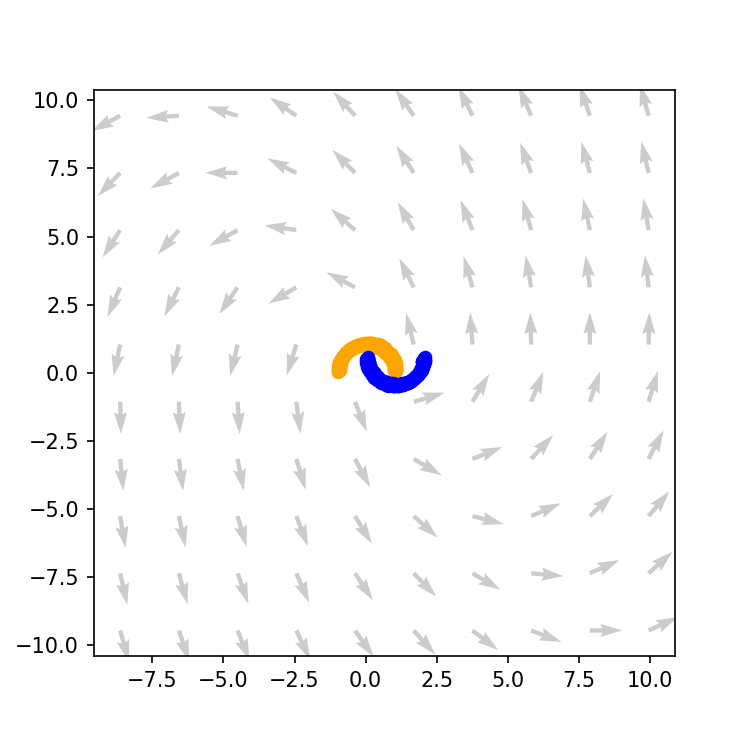
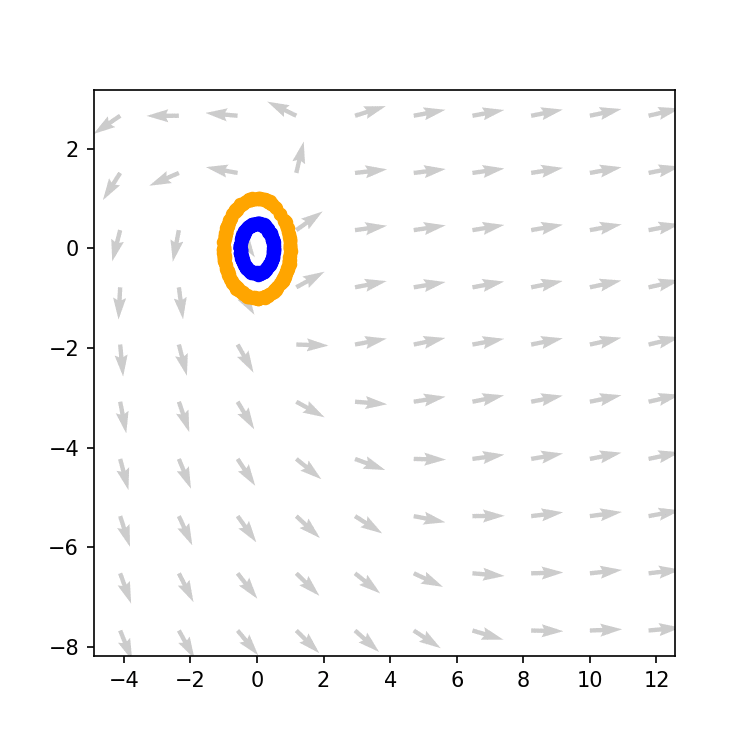
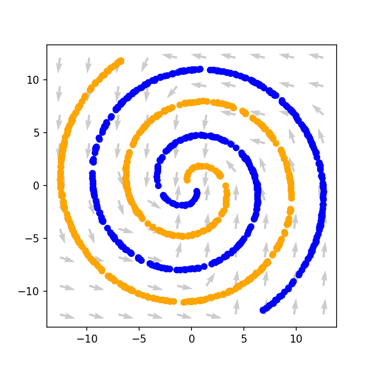

# NeuralODEs - A journey
Project of course *Computational Statistics* @ PoliMi - Second Edition, A.A. 2021/2022, First Semester

## Team

* Luca Caivano
* Paulina Moskwa
* Manfred Nesti

## Notebooks

### Half moons
In `notebooks/2D_Half_Moons.ipynb` a NeuralODE is used to classify points of the half moons dataset.
{:height="10px" width="10px"}

### Concentric Annuli
In `notebooks/2D_Concentric_Annuli.ipynb` a NeuralODE is used to classify points of the concentric annuli dataset.

### Concentric Spirals
* In `notebooks/2D_Spirals_Augmented.ipynb` a vanilla NeuralODE is used to classify points of the concentric spirals dataset.

* In `notebooks/2D_Spirals.ipynb` a NeuralODE with augmentation technique is used to improve performance on concentric spirals dataset.

### MNIST dataset
In `notebooks/MNIST.ipynb` a NeuralODE is used to classify IMAGE dataset's images, providing the accuracy on the test set and visualizing the trajectories of the images in their space. The trained model can be saved and upload using the from the file `notebooks/MNIST_model.pt`.

## Media
Al media (GIF and images) used in the slides.

## References
* Ricky T. Q. Chen, et al. | *“Neural Ordinary Differential Equations”* | 32nd Conference on NeurIPS, 2019
* Stefano Massaroli, Michael Poli, et al. | *“Dissecting NeuralODEs”* | 34th Conference on NeurIPS, 2021
* Software: *TorchDyn: Implicit Models and Neural Numerical Methods in PyTorch* |  S. Massaroli, M. Poli, et. al | ([doc](https://torchdyn.readthedocs.io/en/stable/tutorials/quickstart.html))
* *Repository: Dissecting NeuralODEs* | S. Massaroli, M. Poli, et. al | ([repo](https://github.com/DiffEqML/diffeqml-research/tree/master/dissecting-neural-odes))   
* *Repository: torchdyn/tutorials/* | S. Massaroli, M. Poli, et. al | ([repo](https://github.com/DiffEqML/torchdyn/tree/master/tutorials))
